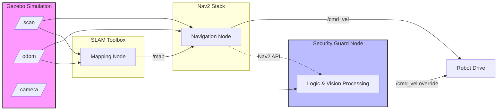

# AutoNav Sim: Autonomous Mobile Robot Simulation 🤖📍


A comprehensive simulation environment for developing and testing autonomous navigation algorithms, featuring SLAM, path planning (Nav2), and computer vision-based behaviors.

---

## 📸 Demo & Visuals


> **SLAM:** The robot exploring the `room.world` and generating a map in RViz (SLAM in action).


> **Navigation:** Left side: Gazebo view of the robot navigating the room. Right side: RViz view of the robot with the planned path and navigation costmap.

---

## 🚀 Project Overview

**AutoNav Sim** is a modular robotics framework designed to simulate a differential drive robot in complex environments. Built on **ROS 2 Humble**, it serves as a testbed for verifying navigation stacks and perception algorithms before deployment on physical hardware.

This project demonstrates expertise in:

* **Full-Stack Robotics:** From URDF modeling to high-level behavior scripting.
* **Autonomous Navigation:** Implementing the **Nav2** stack for dynamic path planning and obstacle avoidance.
* **SLAM (Simultaneous Localization and Mapping):** Using `slam_toolbox` for real-time occupancy grid generation.
* **Computer Vision:** Integrating **OpenCV** with ROS 2 nodes for object detection and tracking.
* **DevOps & Reproducibility:** Fully containerized development environment using **Docker** and **Docker Compose**.

---

## 🛠️ Key Features

### 1. Autonomous Navigation & Mapping

The robot utilizes the standard ROS 2 Navigation Stack (Nav2) to navigate known and unknown environments.

* **Mapping:** Asynchronous SLAM using `slam_toolbox`.
* **Localization:** AMCL (Adaptive Monte Carlo Localization) particle filter.
* **Planning:** A* (Global Planner) and DWB (Local Planner) controllers.

### 2. Intelligent Behaviors

Custom Python nodes extend the robot's capabilities beyond simple point-to-point navigation:

* **🛡️ Security Guard Mode:** A hybrid behavior state machine. The robot autonomously patrols a set of waypoints. If an "intruder" (specifically colored object) is detected via the camera, it interrupts the patrol to track and chase the target.
* **🔴 Ball Chaser:** A reactive vision-based controller that uses HSV color thresholding to follow targets.

### 3. Simulation Environment

* **Gazebo:** Physics-based simulation with custom worlds (`obstacles.world`, `intruder.world`).
* **RViz:** configured for visualizing Lidar scans, costmaps, and camera feeds.
* **URDF/Xacro:** Modular robot description including Lidar, Camera, and Differential Drive plugins.

---

## 🏗️ System Architecture



The system is built on a distributed node architecture:

* **`my_bot` Package:** The core package containing launch files, config, and source code.
* **Docker Container:** Encapsulates ROS 2 Humble, classic Gazebo, and all dependencies, ensuring the simulation runs identically on any Linux machine (or WSL).

---

## 💻 Installation & Usage

### Prerequisites

* Docker & Docker Compose
* NVIDIA GPU (Optional, for hardware acceleration)

### 1. Build the Environment

```bash
# Build the Docker image containing ROS 2 & dependencies
docker compose build
```

### 2. Run the Simulation

```bash
# Start the container (CPU mode)
docker compose run --rm -p 6080:80 ros_dev

# Inside the container, launch the full simulation
ros2 launch my_bot sim.launch.py
```

### 3. Launch Capabilities

**To start Mapping (SLAM):**

```bash
ros2 launch my_bot slam.launch.py
```

**To start Autonomous Patrol:**

```bash
# Ensure navigation is running first
ros2 launch my_bot navigation.launch.py
# In a new terminal
ros2 run my_bot security_guard.py
```

---

## 📂 Project Structure

```text
src/my_bot/
├── config/         # Params for Nav2, SLAM, and RViz
├── launch/         # Python launch files for Sim, SLAM, and Nav
├── maps/           # Saved occupancy grids
├── my_bot/         # Python nodes (CV logic, Behavior Trees)
├── urdf/           # Robot physical description (Xacro)
└── worlds/         # Gazebo simulation environments
```

---

## 🔮 Future Improvements

* [ ] Implement **BehaviorTree.CPP** for more complex decision-making logic.
* [ ] Integrate **YOLOv8** for semantic object detection instead of simple color thresholding.
* [ ] Add **EKF (Extended Kalman Filter)** Sensor Fusion (IMU + Odom) for better localization accuracy.

---

## 👤 Author

**Diego Ortiz**
*Robotics Engineer | ROS 2 Developer*

[🔗 LinkedIn](https://www.linkedin.com/in/diego-ortiz-maldonado/) | [🔗 Portfolio](https://www.diego-ortiz.net/)
