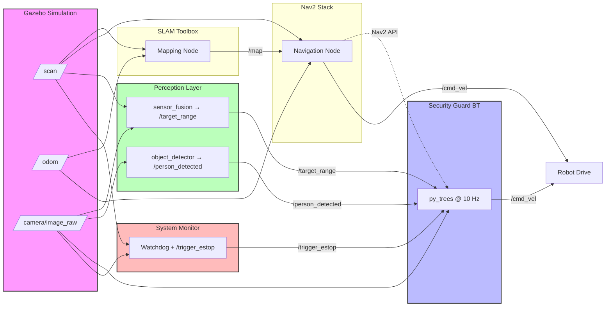

# AutoNav Sim: Autonomous Mobile Robot Simulation 🤖📍


A comprehensive simulation environment for developing and testing autonomous navigation algorithms, featuring SLAM, path planning (Nav2), LiDAR-camera sensor fusion, Behavior Trees, YOLO object detection, and a system watchdog — all running in a reproducible Docker container.

---

## 📸 Demo & Visuals


> **SLAM:** The robot exploring the `room.world` and generating a map in RViz (SLAM in action).


> **Navigation:** Left side: Gazebo view of the robot navigating the room. Right side: RViz view of the robot with the planned path and navigation costmap.

---

## 🚀 Project Overview

**AutoNav Sim** is a modular robotics framework for simulating a differential drive robot in complex environments. Built on **ROS 2 Humble**, it serves as a testbed for verifying navigation stacks and perception algorithms before deployment on physical hardware.

This project demonstrates expertise in:

* **Full-Stack Robotics:** From URDF/Xacro modeling (with realistic sensor noise) to high-level behavior scripting.
* **Autonomous Navigation:** The **Nav2** stack with A* global planner and DWB local planner.
* **SLAM:** `slam_toolbox` for real-time occupancy grid generation.
* **Sensor Fusion:** LiDAR-camera fusion node that projects camera pixel bearings onto LiDAR scan ranges for metric distance estimation.
* **Behavior Trees:** `py_trees`-based security guard with dual-modal detection (HSV + YOLOv8).
* **Deep Learning Inference:** YOLOv8-nano ONNX node with GPU auto-select (CUDA → CPU fallback).
* **DevOps & Reproducibility:** Fully containerized development environment with CI/CD via GitHub Actions.

---

## 🛠️ Key Features

### 1. Autonomous Navigation & Mapping

* **Mapping:** Asynchronous SLAM using `slam_toolbox`.
* **Localization:** AMCL (Adaptive Monte Carlo Localization) particle filter.
* **Planning:** A* (Global Planner) and DWB (Local Planner) controllers.

### 2. LiDAR-Camera Sensor Fusion

`sensor_fusion.py` fuses the camera and LiDAR in real time:

1. Detects the red target via HSV thresholding → computes pixel centroid.
2. Converts the pixel column to a bearing angle using camera intrinsics (FOV=1.089 rad, fx≈534.8 px).
3. Maps the bearing to the nearest LiDAR scan index and reads the metric range.
4. Publishes `/target_range` (Float32, metres) and `/target_position` (PointStamped in `base_link`).

Both security guard nodes subscribe to `/target_range` for accurate, metric stop-distance decisions — replacing the fragile contour-area heuristic.

### 3. Behavior Tree Security Guard

`security_guard_bt.py` implements patrol + intruder interception as a `py_trees` BehaviourTree, ticked at 10 Hz:

```
Selector("SecurityGuardRoot")
├── Sequence("IntruderProtocol")          ← HIGH PRIORITY
│   ├── IntruderVisible                   ← HSV OR YOLO detection (blackboard)
│   ├── CancelPatrol                      ← cancels active Nav2 goal
│   └── Selector("ApproachControl")
│       ├── TooClose                      ← range < 0.8 m → hold position
│       └── ChaseIntruder                 ← proportional cmd_vel
└── Sequence("PatrolProtocol", memory=True)  ← LOW PRIORITY
    ├── NavigateToWaypoint                ← Nav2 goToPose
    ├── WaitAtWaypoint                    ← configurable dwell timer
    └── IncrementWaypoint                 ← wraps waypoint index
```

Publishes mission metrics to `/security_guard/metrics` (DiagnosticArray, 5 s interval) and RViz sphere markers to `/intruder_sightings` for each new sighting event.

### 4. LifecycleNode Security Guard

`security_guard.py` is the imperative version implemented as a **ROS 2 LifecycleNode** with the full `Unconfigured → Inactive → Active` state machine. It reads `/target_range` from sensor fusion for metric stopping and supports clean configure/activate/deactivate/cleanup cycles.

### 5. YOLOv8-nano Object Detector

`object_detector.py` runs YOLOv8-nano ONNX inference on `/camera/image_raw`:

* Auto-selects `CUDAExecutionProvider` (GPU) with `CPUExecutionProvider` fallback.
* Publishes `/detections` (MarkerArray), `/person_detected` (Bool), `/target_detected` (Bool).
* If the model file is missing, logs a warning and falls back gracefully — HSV detection remains active.

### 6. System Watchdog

`system_monitor.py` monitors heartbeats from `/scan` and `/camera/image_raw`:

* Publishes `/system_health` (DiagnosticArray) at 1 Hz.
* Provides a `/trigger_estop` service that zeros `/cmd_vel` and requests lifecycle deactivation of `security_guard`.

### 7. Dynamic Obstacle Environment

`dynamic.world` adds two autonomously moving obstacles alongside the intruder sphere:

* **`moving_box_1`** (blue, 0.5×0.5×1.0 m) and **`moving_cylinder_1`** (orange, r=0.3 m).
* Each obstacle uses the `libgazebo_ros_planar_move.so` Gazebo plugin (defined in SDF), remapping `cmd_vel` to `obstacle1_cmd_vel` / `obstacle2_cmd_vel`.
* `obstacle_controller.py` publishes random-walk `Twist` commands to those topics at 10 Hz, reversing direction near the boundary radius.

### 8. Realistic Sensor Noise (URDF/Xacro)

Gaussian noise is declared directly in the Xacro URDF files:

| Sensor | Type | stddev |
|--------|------|--------|
| LiDAR (`lidar.xacro`) | Gaussian range noise | **0.01 m** |
| Camera (`camera.xacro`) | Gaussian pixel intensity noise | **0.007** |

### 9. CI/CD Pipeline

GitHub Actions (`.github/workflows/ci.yml`) runs on every push and PR to `main`:
1. Ament linting (PEP 8, naming conventions)
2. URDF/Xacro validation
3. Script shebang and executability checks
4. Pytest with Codecov coverage upload

---

## 🏗️ System Architecture


```mermaid
graph LR
    subgraph Gazebo [Gazebo Simulation]
        GZ_Scan[/scan/]
        GZ_Odom[/odom/]
        GZ_Cam[/camera/image_raw/]
    end

    subgraph SLAM [SLAM Toolbox]
        STB[Mapping Node]
    end

    subgraph Nav [Nav2 Stack]
        N2[Navigation Node]
    end

    subgraph Perception [Perception Layer]
        SF[sensor_fusion → /target_range]
        OD[object_detector → /person_detected]
    end

    subgraph Guard [Security Guard BT]
        BT[py_trees @ 10 Hz]
    end

    subgraph Monitor [System Monitor]
        WD[Watchdog + /trigger_estop]
    end

    GZ_Scan --> STB
    GZ_Odom --> STB
    STB -->|/map| N2

    GZ_Scan --> N2
    GZ_Odom --> N2

    GZ_Scan --> SF
    GZ_Cam --> SF
    GZ_Cam --> OD

    SF -->|/target_range| BT
    OD -->|/person_detected| BT
    GZ_Cam --> BT

    N2 -.->|Nav2 API| BT
    BT -->|/cmd_vel| GZ_Drive[Robot Drive]
    N2 -->|/cmd_vel| GZ_Drive

    GZ_Scan --> WD
    GZ_Cam --> WD
    WD -->|/trigger_estop| BT

    style Gazebo fill:#f9f,stroke:#333,stroke-width:2px
    style Guard fill:#bbf,stroke:#333,stroke-width:2px
    style Perception fill:#bfb,stroke:#333,stroke-width:2px
    style Monitor fill:#fbb,stroke:#333,stroke-width:2px
```

---

## 💻 Installation & Usage

### Prerequisites

* Docker & Docker Compose
* NVIDIA GPU (optional — required for YOLO GPU acceleration)

### 1. Build the Environment

```bash
docker compose build
```

### 2. Start the Container

```bash
# CPU mode
make up

# GPU mode (for YOLO acceleration)
make up-gpu
```

### 3. Enter the Container

```bash
make shell
```

### 4. Build the ROS 2 Workspace

```bash
# Run once after first clone, and after any code changes
make build
```

---

## 🎮 Running the Simulation

All commands below are run **inside the container** (after `make shell`).

### Core Simulation

```bash
# Gazebo + RViz (basic room world)
make sim

# Gazebo + RViz with moving obstacles and intruder sphere
make dynamic-sim
```

### Mapping & Navigation

```bash
# SLAM mapping — drive with make teleop in a second terminal
make slam

# Autonomous navigation (requires a saved map)
make nav

# Keyboard control (robot)
make teleop

# Keyboard control (intruder sphere)
make teleop-target
```

### Behavior Nodes

```bash
# Full security guard stack: sensor_fusion + LifecycleNode guard + watchdog
ros2 launch my_bot security_guard_full.launch.py

# Behavior Tree version of the security guard (recommended)
make security-guard-bt

# LifecycleNode version (imperative state machine)
make security-guard

# LiDAR-camera sensor fusion only
make sensor-fusion

# System watchdog + /trigger_estop service
make system-monitor

# YOLOv8-nano ONNX inference node
make object-detector

# Autonomous intruder random-walk bot
make intruder-bot

# Ball chaser (reactive follower)
make ball-chaser
```

### Triggering the E-Stop

```bash
ros2 service call /trigger_estop std_srvs/srv/Trigger
```

### Saving a Map

```bash
# After running make slam and driving around:
ros2 run nav2_map_server map_saver_cli -f /root/dev_ws/src/my_bot/maps/my_map
```

---

## 🧪 Testing & Linting

```bash
# Run linting (ament_lint_auto + pytest with coverage)
make lint

# Run unit tests only
make test
```

The test suite (69/70 tests) runs without a ROS runtime and covers:
* URDF noise values and wheel friction (`test_urdf.py`)
* Sensor fusion math — bearing, scan index, range validation (`test_sensor_fusion.py`)
* BT leaf logic and tree structure (`test_behavior_tree.py`)
* YOLO preprocess/postprocess functions (`test_object_detector.py`)
* `behavior_params.yaml` schema (`test_behavior_params.py`)
* Script shebangs and compile checks (`test_scripts.py`)

---

## 📂 Project Structure

```text
src/my_bot/
├── config/
│   ├── nav2_params.yaml                 # Navigation stack tuning
│   ├── mapper_params_online_async.yaml  # SLAM tuning
│   ├── behavior_params.yaml             # Centralized HSV + behavior parameters
│   └── navigation.rviz / view_robot.rviz
├── launch/
│   ├── sim.launch.py                    # Gazebo + RViz (room world)
│   ├── dynamic_sim.launch.py            # Gazebo with moving obstacles
│   ├── slam.launch.py                   # SLAM mapping
│   ├── navigation.launch.py             # Nav2 stack
│   ├── sensor_fusion.launch.py          # Sensor fusion node only
│   └── security_guard_full.launch.py    # sensor_fusion + security_guard + monitor
├── maps/                                # Saved occupancy grids
├── my_bot/
│   ├── sensor_fusion.py                 # LiDAR-camera fusion → /target_range
│   ├── security_guard_bt.py             # py_trees BT security guard
│   ├── security_guard.py                # LifecycleNode security guard
│   ├── object_detector.py               # YOLOv8-nano ONNX (GPU/CPU)
│   ├── system_monitor.py                # Watchdog + /trigger_estop
│   ├── intruder_bot.py                  # Autonomous intruder random walk
│   ├── obstacle_controller.py           # Dynamic obstacle random-walk driver
│   ├── ball_chaser.py                   # Reactive red-ball follower
│   └── patrol.py                        # Simple waypoint navigation
├── test/                                # 69 unit tests (no ROS runtime needed)
├── urdf/
│   ├── lidar.xacro                      # 2D LiDAR + Gaussian noise (σ=0.01m)
│   ├── camera.xacro                     # RGB camera 30Hz + Gaussian noise (σ=0.007)
│   ├── robot_core.xacro                 # Body + differential drive
│   └── gazebo_control.xacro             # Gazebo plugins; wheel friction μ=1.0
└── worlds/
    ├── room.world                        # Simple room
    ├── obstacles.world                   # Static obstacles
    ├── intruder.world                    # Room + movable intruder sphere
    └── dynamic.world                     # intruder.world + 2 moving obstacles
```

---

## 🔑 Make Targets Reference

| Target | Description |
|--------|-------------|
| `make up` | Start CPU container |
| `make up-gpu` | Start GPU container (autonav_gpu) |
| `make shell` | Enter the running container |
| `make build` | Build ROS 2 workspace with colcon |
| `make clean` | Remove build artifacts |
| `make lint` | ament_lint_auto + pytest with coverage |
| `make test` | pytest only |
| `make sim` | Gazebo + RViz (room world) |
| `make dynamic-sim` | Gazebo with moving obstacles + intruder |
| `make slam` | SLAM mapping |
| `make nav` | Nav2 autonomous navigation |
| `make teleop` | Keyboard control (robot) |
| `make teleop-target` | Keyboard control (intruder sphere) |
| `make security-guard-bt` | py_trees BT security guard |
| `make security-guard` | LifecycleNode security guard |
| `make sensor-fusion` | LiDAR-camera sensor fusion node |
| `make system-monitor` | Watchdog + e-stop service |
| `make object-detector` | YOLOv8-nano ONNX inference |
| `make intruder-bot` | Autonomous random-walk intruder |
| `make ball-chaser` | Reactive ball follower |

---

## 👤 Author

**Diego Ortiz**
*Robotics Engineer | ROS 2 Developer*

[🔗 LinkedIn](https://www.linkedin.com/in/diego-ortiz-maldonado/) | [🔗 Portfolio](https://www.diego-ortiz.net/)
