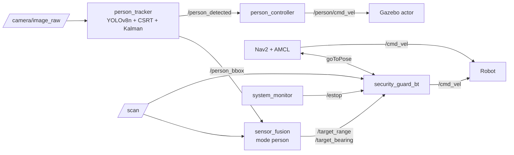

# AutoNav Sim: Autonomous Mobile Robot Simulation 🤖📍


A comprehensive simulation environment for developing and testing autonomous navigation algorithms, featuring SLAM, path planning (Nav2), LiDAR-camera sensor fusion, Behavior Trees, YOLO object detection, and a system watchdog — all running in a reproducible Docker container.

---

## 📸 Demo & Visuals


> **SLAM:** The robot exploring the `room.world` and generating a map in RViz (SLAM in action).


> **Navigation:** Left side: Gazebo view of the robot navigating the room. Right side: RViz view of the robot with the planned path and navigation costmap.

---

## 🚀 Project Overview

**AutoNav Sim** is a modular robotics framework for simulating a differential drive robot (modelled on the TurtleBot3 Waffle Pi) in a museum environment. Built on **ROS 2 Humble**, it serves as a testbed for verifying navigation stacks and perception algorithms before deployment on physical hardware.

This project demonstrates expertise in:

* **Full-Stack Robotics:** From URDF/Xacro modeling (with realistic sensor noise) to high-level behavior scripting.
* **Autonomous Navigation:** The **Nav2** stack with A* global planner and DWB local planner, AMCL localization and `slam_toolbox` mapping.
* **Deep Learning Perception:** YOLOv8-nano (ONNX on CPU; CUDA if the image has the CUDA 12 runtime) seeding an OpenCV tracker smoothed by a Kalman filter.
* **Sensor Fusion:** Camera boxes ranged with the LiDAR, cross-checked against a monocular estimate.
* **Behavior Trees:** A `py_trees` security guard that patrols, follows intruders, searches for them and obeys an e-stop.
* **DevOps & Reproducibility:** Fully containerized development environment with CI/CD via GitHub Actions.

---

## 🎬 Scenarios

Everything is grouped into four one-command scenarios. Each opens Gazebo and an RViz layout made for it. Run them from the host. The `make` targets `docker exec` into the container.

| Command | What you see |
|---------|--------------|
| `make sim` | The robot in the museum (`room.world`), nothing else. Drive it with `make teleop`. |
| `make nav-sim` | `sim` + Nav2 in one go: map, costmaps and AMCL pose appear immediately. Send goals with RViz's **Nav2 Goal** tool. |
| `make ball-sim` | The robot chases a red ball around the museum. |
| `make person-sim` | **The full demo:** a security guard that patrols, spots a running person with YOLO, follows them, searches when they escape and resumes the patrol. |
| `make yolo-sim` | A person standing in front of the robot: proof of YOLO detection + LiDAR fusion. |

> **Why does `make sim` show no map?** `make sim` opens the navigation RViz layout, but nothing publishes `/map` (or the `map → odom` transform) until Nav2's map_server and AMCL run. Start them with `make nav` in a second terminal, or use `make nav-sim`, which starts both. AMCL's initial pose is the spawn point (`nav2_params.yaml`), so no "2D Pose Estimate" click is needed.

### `make ball-sim`: chase the ball

```
ball.world ──▶ camera ──▶ sensor_fusion (mode hsv) ──▶ /target_range, /target_bearing ──▶ ball_chaser ──▶ /cmd_vel
                  lidar ──┘                                                          ball_controller ──▶ /ball/cmd_vel
```

* **ball_controller** drives the ball on a figure-eight through the U where the robot starts and the hall to its right. The path is checked against the map to keep the ball over 1 m from every wall. The ball plays with the robot: it runs when the robot gets close, waits when the robot falls behind, pauses now and then, and sometimes turns back.
* **sensor_fusion** finds the red blob, converts its pixel span to bearings and takes a low percentile of the LiDAR beams inside it as the range.
* **ball_chaser** keeps 1 m from the ball's surface; when the ball is lost it turns toward where it was last seen.
* **`make teleop-ball`** (second terminal) takes the ball over by hand. Hold `w a s d` (or `q e z c` for diagonals) to move it and release to stop. By default the keys are relative to the robot's view: `w` = away from the robot, `a` = the robot's left. `m` switches to world axes and `+`/`-` change speed. Quit with Ctrl-C and the autopilot resumes.
* Options: `ros2 launch my_bot ball_sim.launch.py chase:=false` (drive the robot yourself) or `autopilot:=false` (ball only moves when teleoperated).

### `make person-sim`: security guard (the demo)


```mermaid
graph LR
    CAM[/camera/image_raw/] --> PT[person_tracker<br/>YOLOv8n + CSRT + Kalman]
    PT -->|/person_bbox| SF[sensor_fusion<br/>mode person]
    SCAN[/scan/] --> SF
    SF -->|/target_range<br/>/target_bearing| BT[security_guard_bt]
    SCAN --> BT
    NAV[Nav2 + AMCL] <-->|goToPose| BT
    BT -->|/cmd_vel| ROBOT[Robot]
    NAV -->|/cmd_vel| ROBOT
    PT -->|/person_detected| PC[person_controller]
    PC -->|/person/cmd_vel| ACTOR[Gazebo actor]
    SM[system_monitor] -->|/estop| BT
```

The behaviour tree, ticked at 10 Hz:

```
Selector("SecurityGuard")
├── Sequence("EmergencyStop")      EStopActive → HaltRobot
├── Sequence("IntruderProtocol")   IntruderVisible → CancelPatrol → FollowIntruder (2.5 m stand-off)
├── Sequence("SearchProtocol")     IntruderRecentlyLost → CancelPatrol → SearchLastSeen
└── Sequence("PatrolProtocol")     NavigateToWaypoint → WaitAtWaypoint → IncrementWaypoint
```

* **person_controller** animates the pedestrian: it **walks** between random spots, **runs** away once the robot's tracker locks on, and is **exhausted** after a sprint. Gazebo actors have no physics, so it steers on the saved museum map. It only picks targets in line of sight, takes the heading closest to its goal that has free floor ahead, and caps its speed so it can always stop before a wall. A test simulates minutes of walking and fleeing on the real map and checks the person never gets within 0.5 m of a wall.
* **person_tracker**: YOLOv8n reseeds an OpenCV tracker every 10 frames or 0.5 s, whichever comes first; a Kalman filter smooths the box and coasts through short dropouts.
* **sensor_fusion** (mode `person`) ranges the box with the LiDAR and falls back to a monocular estimate (person height / feet ground contact) when the beams miss the legs.
* **security_guard_bt** publishes its active protocol on `/security_guard/state`, mission metrics on `/security_guard/metrics` and sighting markers on `/intruder_sightings`.
* **E-stop:** `ros2 service call /trigger_estop std_srvs/srv/Trigger` latches it (the robot halts and Nav2 is cancelled). `ros2 service call /clear_estop std_srvs/srv/Trigger` releases it.

### `make yolo-sim`: perception proof

A person stands 3 m in front of the robot, with a crate and a barrel to either side. RViz shows the **Sensor fusion** image: the YOLO box around the person only, labelled with the fused range (≈2.6 m, where the lidar hits the front shin) with its source (lidar or camera) and bearing. Check it numerically with `ros2 topic echo /target_range`. Drive around with `make teleop` and watch range and bearing follow. Enable the **YOLO tracker** image display to see the raw tracker output.

---

## 🛠️ Other Features

* **Mapping:** `make slam` (with `make sim` + `make teleop`), then `make save-map`.
* **Realistic sensor noise** in the Xacro URDF: LiDAR range σ = 0.01 m, camera pixel σ = 0.007.
* **System watchdog** (`make system-monitor`, built into `person-sim`): `/system_health` diagnostics from `/scan` and camera heartbeats, plus the e-stop services.
* **CI/CD:** GitHub Actions builds the workspace, runs the tests (launch files are built against a real ROS install) and uploads coverage.

---

## 💻 Installation & Usage

### Prerequisites

* Docker & Docker Compose
* NVIDIA GPU (optional — speeds up YOLO)

### Setup

```bash
docker compose build   # build the image (also exports the YOLOv8n ONNX model)
make up                # start the container (CPU) — or: make up-gpu
make build             # build the ROS 2 workspace (after every code change)
```

Then run any scenario from the table above. `make shell` opens a shell inside the container for `ros2 topic echo` and friends.

---

## 🧪 Testing & Linting

```bash
make test   # unit tests
make lint   # linters
```

The suite runs without a ROS runtime (ROS packages are stubbed in `test/conftest.py`) and covers:
* Ball path clearance on the real map, autopilot behaviour, teleop keys (`test_ball.py`)
* Person behaviour, wall avoidance simulated on the museum map, tracker and fusion helpers (`test_person.py`)
* Behaviour-tree leaves and whole-tree protocol switching (`test_behavior_tree.py`)
* Sensor fusion math (`test_sensor_fusion.py`) and YOLO pre/post-processing (`test_object_detector.py`)
* `behavior_params.yaml` types and patrol waypoints on open floor (`test_behavior_params.py`)
* Entry points, Makefile ↔ launch ↔ world ↔ RViz wiring, launch files build (`test_scripts.py`)
* URDF noise values, wheel friction, meshes and geometry (`test_urdf.py`)

---

## 📂 Project Structure

```text
src/my_bot/
├── config/
│   ├── behavior_params.yaml             # Parameters of every behaviour node
│   ├── nav2_params.yaml                 # Navigation stack tuning
│   ├── mapper_params_online_async.yaml  # SLAM tuning
│   ├── navigation.rviz                  # sim / nav-sim / nav: map, costmap, plan
│   ├── perception.rviz                  # ball-sim, yolo-sim: fused target + annotated image
│   └── person.rviz                      # person-sim: navigation + perception + sightings
├── launch/
│   ├── sim.launch.py                    # make sim (base of every scenario)
│   ├── nav_sim.launch.py                # make nav-sim
│   ├── ball_sim.launch.py               # make ball-sim
│   ├── person_sim.launch.py             # make person-sim
│   ├── yolo_sim.launch.py               # make yolo-sim
│   ├── navigation.launch.py             # make nav (Nav2 only)
│   ├── slam.launch.py                   # make slam
│   └── rsp.launch.py                    # robot_state_publisher
├── maps/                                # Saved museum map (also used by the person & ball tests)
├── my_bot/
│   ├── sensor_fusion.py                 # camera box + lidar → range / bearing (hsv | person)
│   ├── follow_control.py                # stand-off follow law (ball_chaser + BT)
│   ├── ball_chaser.py                   # ball-sim: follow the fused ball
│   ├── ball_controller.py               # ball-sim: ball autopilot + teleop arbitration
│   ├── ball_teleop.py                   # make teleop-ball
│   ├── person_tracker.py                # YOLO + OpenCV tracker + Kalman
│   ├── object_detector.py               # YOLOv8 pre/post-processing
│   ├── person_controller.py             # pedestrian WALK / RUN / EXHAUSTED on the map
│   ├── clearance_map.py                 # distance-to-wall lookups on the saved map
│   ├── security_guard_bt.py             # py_trees security guard
│   └── system_monitor.py                # watchdog + e-stop
├── test/                                # unit tests (no ROS runtime needed)
├── meshes/                              # TurtleBot3 Waffle Pi STL meshes (Apache-2.0)
├── urdf/                                # Xacro robot description (lidar + camera noise)
└── worlds/
    ├── room.world                       # the museum (sim, nav-sim)
    ├── ball.world                       # museum + red ball
    ├── person.world                     # museum + pedestrian actor
    └── yolo.world                       # flat ground + standing person, crate, barrel
src/person_actor_plugin/                 # Gazebo plugin: velocity-driven walking/running actor
```

---

## 🔑 Make Targets Reference

| Target | Description |
|--------|-------------|
| `make up` / `make up-gpu` / `make down` | Start (CPU / GPU) or stop the container |
| `make shell` | Enter the running container |
| `make build` / `make clean` | Build the workspace / remove build artifacts |
| `make test` / `make lint` | Unit tests / linters |
| `make sim` | Robot in the museum, Gazebo + RViz |
| `make nav-sim` | `sim` + Nav2 in one command |
| `make ball-sim` | Ball chase (fusion + chaser + ball autopilot) |
| `make person-sim` | Security guard demo (Nav2 + YOLO + fusion + BT + watchdog) |
| `make yolo-sim` | Static person: YOLO + fusion proof |
| `make teleop` | Keyboard control of the robot |
| `make teleop-ball` | Keyboard control of the ball (ball-sim) |
| `make slam` / `make save-map NAME=x` | SLAM mapping / save the map |
| `make nav` | Nav2 only, next to an already running sim |
| `make system-monitor` | Watchdog + e-stop services (already part of person-sim) |

---

## 👤 Author

**Diego Ortiz**
*Robotics Engineer | ROS 2 Developer*

[🔗 LinkedIn](https://www.linkedin.com/in/diego-ortiz-maldonado/) | [🔗 Portfolio](https://www.diego-ortiz.net/)
