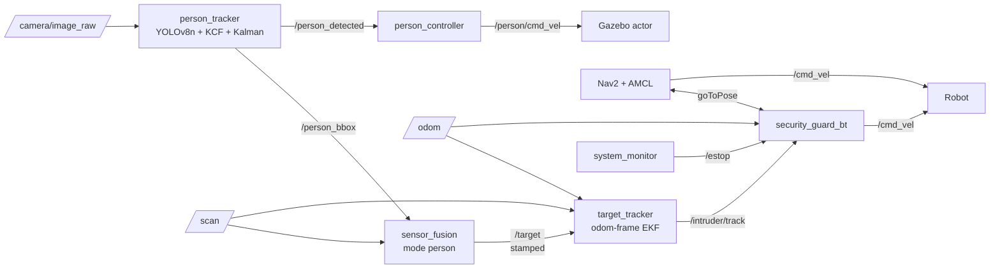

<div align="center">
    
# AutoNav Sim: Detect, Track and Follow People with a Mobile Robot


</div>

**A ROS 2 perception-to-action pipeline that lets a mobile robot find a person (or a ball), keep track of them while they move and run away, and react: follow at a safe distance, search where they vanished, or go back to patrolling.** It runs entirely in simulation, in a reproducible Docker container, so the whole stack can be developed, measured and tested before it touches hardware.

---

## 📸 Demo & Visuals

<!-- TODO: record these GIFs and drop them in assets/ (see the filenames below) -->


> **Person tracking** *(placeholder: `assets/person_tracking.gif`)*: `make person-sim`. Camera view with the YOLO box and fused range/bearing next to RViz showing the intruder track (2σ ellipse, velocity arrow) while the person walks, sprints away and the robot follows.


> **Security guard** *(placeholder: `assets/security_guard.gif`)*: `make person-sim`. The full loop: patrol, intruder spotted, follow at 2.5 m, target lost, search, back to patrol.


> **Ball chase** *(placeholder: `assets/ball_chase.gif`)*: `make ball-sim`. The robot following the red ball, with the Sensor fusion image showing the detected blob.


> **SLAM:** The robot exploring the `room.world` museum and generating the map used by every scenario.


> **Navigation:** Left: Gazebo view of the robot navigating the room. Right: RViz with the planned path and costmap.

---

## 🎯 Why this project?

Most "follow me" or "guard this area" robots fail for the same reason: **perception is noisy, late and intermittent.** A detector misses frames, a camera has no depth, a lidar cannot tell a person from a pillar, and by the time a detection reaches the controller the target has moved and the robot has turned. AutoNav Sim is a testbed for solving exactly that part:

1. **Detect** the target in the camera (YOLOv8 for people, colour segmentation for the ball we started with).
2. **Range** it by fusing the camera box with the lidar, with a monocular fallback when the lidar misses.
3. **Track** it over time (OpenCV tracker + Kalman filter in the image, constant-velocity EKF in the world) so the robot keeps a stable estimate through occlusions and detector dropouts.
4. **Compensate latency** so the robot steers toward where the target *is now*, not where the image saw it.
5. **Act** with a behaviour tree: patrol, follow, search, emergency stop.

The ball chase was the starting point: a bright, easy target to validate fusion, latency compensation and the follow controller. The same pipeline then got swapped to a moving pedestrian with a harder detector, a real tracker and an autonomous guard on top.

### Where this applies

| Application | What the pipeline provides |
|-------------|----------------------------|
| **Security & patrol robots** (museums, warehouses, car parks, data centres) | Spot a person, keep eyes on them at a stand-off distance, report sightings, resume patrol when they leave. |
| **Person-following carts and porters** (hospitals, airports, retail, logistics) | Lock on to one person and follow them through a building with a safe distance and an e-stop. |
| **Assistive and elder-care robots** | Stay near a person without crowding them; recover when they go out of view. |
| **Search & rescue / inspection** | Re-acquire a moving target after loss by turning toward its last-seen side. |
| **Camera and sports robots** (filming, ball retrieval) | Follow a moving subject or a ball while avoiding walls. |
| **Human-robot interaction research** | A repeatable pedestrian that walks, flees and tires, to benchmark trackers and followers against. |

> This is a simulation project: it shows the architecture and the engineering needed for these systems, not a certified product.

---

## 🚀 What it demonstrates

* **Person detection:** YOLOv8-nano (ONNX, 320 px input; CPU by default, CUDA if the image has the CUDA 12 runtime), run in a worker thread so every camera frame is still tracked and published without waiting for inference.
* **Visual tracking:** KCF (CSRT/MIL fallback) re-seeded by YOLO, smoothed by a Kalman filter that coasts through short dropouts. A late YOLO result is replayed through the frames that arrived meanwhile.
* **Camera + lidar fusion:** the box's angular span selects lidar beams; a low percentile gives the range. In person mode it is cross-checked against a monocular estimate (person height, or feet ground contact).
* **World-frame tracking:** a constant-velocity EKF on odometry coordinates with time-based prediction, retrodiction of late measurements, chi-square gating and a tentative → confirmed → lost track lifecycle. Lidar clusters refine a confirmed track only when exactly one cluster is in the gate.
* **Latency compensation:** each detection is anchored in the odom frame at the robot pose of the image's timestamp, then re-expressed relative to the pose *now*. Steering on the raw, stale bearing made the followers overshoot.
* **Behaviour Trees:** a `py_trees` security guard that patrols with **Nav2**, follows, searches and obeys an e-stop.
* **A hard-to-track adversary:** a pedestrian that walks, sprints away when it notices the robot, and gets exhausted, steering on the saved map so it never walks into walls.
* **Full navigation stack:** Nav2 (A* + DWB), AMCL localisation, `slam_toolbox` mapping, URDF/Xacro robot with realistic sensor noise.
* **Engineering:** fully containerised, CI via GitHub Actions, unit tests that run without a ROS runtime, a `make perf` tool for real-time factor, topic rates and message latency.

---

## 🎬 Scenarios

Each scenario is one command: Gazebo, an RViz layout made for it and every node it needs. Run them from the host. The `make` targets `docker exec` into the container.

| Command | What you see |
|---------|--------------|
| `make yolo-sim` | **Detection & fusion proof.** A person stands in front of the robot: YOLO box, fused range and bearing, and the world-frame track. |
| `make ball-sim` | **Where it started.** The robot chases a red ball that runs, waits and pauses around the museum. |
| `make person-sim` | **The full demo.** A security guard that patrols, spots a running person with YOLO, tracks and follows them, searches when they escape and resumes the patrol. |
| `make sim` | The robot in the museum (`room.world`), nothing else. Drive it with `make teleop`. |
| `make nav-sim` | `sim` + Nav2 in one go: map, costmaps and AMCL pose appear immediately. Send goals with RViz's **Nav2 Goal** tool. |

> **Slow machine?** Add `GUI=false` to any scenario (`make person-sim GUI=false`): Gazebo runs without its window and RViz shows the robot, scan, map and camera. With software rendering the Gazebo window costs CPU the simulation needs.

> **Why does `make sim` show no map?** `make sim` opens the navigation RViz layout, but nothing publishes `/map` (or the `map → odom` transform) until Nav2's map_server and AMCL run. Start them with `make nav` in a second terminal, or use `make nav-sim`, which starts both. AMCL's initial pose is the spawn point (`nav2_params.yaml`), so no "2D Pose Estimate" click is needed.

### `make person-sim`: security guard (the main demo)


```mermaid
graph LR
    CAM[/camera/image_raw/] --> PT[person_tracker<br/>YOLOv8n + KCF + Kalman]
    PT -->|/person_bbox| SF[sensor_fusion<br/>mode person]
    SCAN[/scan/] --> SF
    SF -->|/target<br/>stamped| TT[target_tracker<br/>odom-frame EKF]
    SCAN --> TT
    ODOM[/odom/] --> TT
    TT -->|/intruder/track| BT[security_guard_bt]
    ODOM --> BT
    NAV[Nav2 + AMCL] <-->|goToPose| BT
    BT -->|/cmd_vel| ROBOT[Robot]
    NAV -->|/cmd_vel| ROBOT
    PT -->|/person_detected| PC[person_controller]
    PC -->|/person/cmd_vel| ACTOR[Gazebo actor]
    SM[system_monitor] -->|/estop| BT
```

The behaviour tree, ticked at 10 Hz:

```
Selector("SecurityGuard")
├── Sequence("EmergencyStop")      EStopActive → HaltRobot
├── Sequence("IntruderProtocol")   IntruderVisible → CancelPatrol → FollowIntruder (2.5 m stand-off)
├── Sequence("SearchProtocol")     IntruderRecentlyLost → CancelPatrol → SearchLastSeen
└── Sequence("PatrolProtocol")     NavigateToWaypoint → WaitAtWaypoint → IncrementWaypoint
```

* **person_tracker**: YOLOv8n reseeds an OpenCV KCF tracker every 10 frames or 0.5 s, whichever comes first; a Kalman filter smooths the box and coasts through short dropouts. Publishes `/person_bbox`, `/person_track`, `/person_detected` and an annotated debug image.
* **sensor_fusion** (mode `person`) ranges the box with the lidar and falls back to a monocular estimate when the beams miss the legs. Publishes the stamped `/target` (bearing, range) the followers use.
* **target_tracker** runs the world-frame EKF on `/target` + `/scan` + `/odom` and publishes `/intruder/track` (pose, velocity, covariance), `/intruder/predicted`, `/intruder/state` and RViz markers (body, 2σ ellipse, velocity arrow). It works in the odom frame, so it needs no AMCL and is continuous.
* **security_guard_bt** follows the track extrapolated to now, publishes its active protocol on `/security_guard/state`, mission metrics on `/security_guard/metrics` (track losses, follow bearing/range RMS) and sighting markers on `/intruder_sightings`.
* **person_controller** animates the pedestrian: it **walks** between random spots, **runs** away once the robot's tracker locks on, and is **exhausted** after a sprint. Gazebo actors have no physics, so it steers on the saved museum map: line-of-sight targets only, the free heading closest to its goal, and a speed cap so it can always stop before a wall. A test simulates minutes of walking and fleeing on the real map and checks the person never gets within 0.5 m of a wall.
* **E-stop:** `ros2 service call /trigger_estop std_srvs/srv/Trigger` latches it (the robot halts and Nav2 is cancelled). `ros2 service call /clear_estop std_srvs/srv/Trigger` releases it.

### `make yolo-sim`: perception proof

A person stands 3 m in front of the robot, with a crate and a barrel to either side. RViz shows the **Sensor fusion** image: the YOLO box around the person only, labelled with the fused range (≈2.6 m, where the lidar hits the front shin), its source (lidar or camera) and bearing. Check it numerically with `ros2 topic echo /target_range`. Drive around with `make teleop` and watch range and bearing follow. Enable the **YOLO tracker** image display to see the raw tracker output.

### `make ball-sim`: the starting point

```
ball.world ──▶ camera ──▶ sensor_fusion (mode hsv) ──▶ /target (stamped) ──▶ ball_chaser ──▶ /cmd_vel
                  lidar ──┘                                 /odom ──┘   ball_controller ──▶ /ball/cmd_vel
```

The ball is the simplest target (a saturated red blob) and was used to build and validate the shared pieces: fusion, latency compensation and the stand-off follow law.

* **ball_controller** drives the ball on a figure-eight checked against the map to keep it over 1 m from every wall. It plays with the robot: it runs when the robot gets close, waits when the robot falls behind, pauses now and then, and sometimes turns back.
* **sensor_fusion** (mode `hsv`) finds the largest red blob, converts its pixel span to bearings and takes a low percentile of the lidar beams inside it as the range.
* **ball_chaser** keeps 1 m from the ball's surface; when the ball is lost it turns toward where it was last seen.
* **`make teleop-ball`** (second terminal) takes the ball over by hand. Hold `w a s d` (or `q e z c` for diagonals) to move it and release to stop. By default the keys are relative to the robot's view: `w` = away from the robot, `a` = the robot's left. `m` switches to world axes and `+`/`-` change speed. Quit with Ctrl-C and the autopilot resumes.
* Options: `ros2 launch my_bot ball_sim.launch.py chase:=false` (drive the robot yourself) or `autopilot:=false` (ball only moves when teleoperated).

---

## 🛠️ Other Features

* **Mapping:** `make slam` (with `make sim` + `make teleop`), then `make save-map NAME=x`.
* **Realistic sensor noise** in the Xacro URDF: lidar range σ = 0.01 m, camera pixel σ = 0.007. The camera is 320×240 at 15 Hz, which is cheap enough to render in software.
* **System watchdog** (`make system-monitor`, built into `person-sim`): `/system_health` diagnostics from `/scan` and camera heartbeats, plus the e-stop services.
* **Performance tooling:** `make perf` reports the real-time factor, per-topic rates in sim time and message age (latency); `person_tracker` also logs frames/s and mean YOLO/tracker milliseconds.
* **CI/CD:** GitHub Actions builds the workspace, runs the tests (launch files are built against a real ROS install) and uploads coverage.

---

## 💻 Installation & Usage

### Prerequisites

* Docker & Docker Compose
* NVIDIA GPU (optional, renders Gazebo on the GPU; YOLO runs on the CPU unless the image has the CUDA 12 runtime)

### Setup

```bash
docker compose build   # build the image (also exports the YOLOv8n ONNX model)
make up                # start the container (CPU) — or: make up-gpu
make build             # build the ROS 2 workspace (after every code change)
```

After a change to the `Dockerfile` (or if `make yolo-sim` says there is no YOLO model), run `make image` (`make image CONTAINER=autonav_gpu` for the GPU container). It rebuilds the image, recreates the container on it and rebuilds the workspace. `docker compose build` on its own leaves the running container, which every make target uses, on the old image.

Then run any scenario from the table above. `make shell` opens a shell inside the container for `ros2 topic echo` and friends.

---

## 🧪 Testing & Linting

```bash
make test   # unit tests
make lint   # linters
```

The suite runs without a ROS runtime (ROS packages are stubbed in `test/conftest.py`) and covers:
* Ball path clearance on the real map, autopilot behaviour, teleop keys (`test_ball.py`)
* Person behaviour, wall avoidance simulated on the museum map, tracker and fusion helpers (`test_person.py`)
* Behaviour-tree leaves and whole-tree protocol switching (`test_behavior_tree.py`)
* Sensor fusion math (`test_sensor_fusion.py`) and YOLO pre/post-processing (`test_object_detector.py`)
* `behavior_params.yaml` types and patrol waypoints on open floor (`test_behavior_params.py`)
* Entry points, Makefile ↔ launch ↔ world ↔ RViz wiring, launch files build (`test_scripts.py`)
* URDF noise values, wheel friction, meshes and geometry (`test_urdf.py`)

---

## 📂 Project Structure

```text
src/my_bot/
├── config/
│   ├── behavior_params.yaml             # Parameters of every behaviour node
│   ├── nav2_params.yaml                 # Navigation stack tuning
│   ├── mapper_params_online_async.yaml  # SLAM tuning
│   ├── navigation.rviz                  # sim / nav-sim / nav: map, costmap, plan
│   ├── perception.rviz                  # ball-sim, yolo-sim: fused target + annotated image
│   └── person.rviz                      # person-sim: navigation + perception + sightings
├── launch/
│   ├── sim.launch.py                    # make sim (base of every scenario)
│   ├── nav_sim.launch.py                # make nav-sim
│   ├── ball_sim.launch.py               # make ball-sim
│   ├── person_sim.launch.py             # make person-sim
│   ├── yolo_sim.launch.py               # make yolo-sim
│   ├── navigation.launch.py             # make nav (Nav2 only)
│   ├── slam.launch.py                   # make slam
│   └── rsp.launch.py                    # robot_state_publisher
├── maps/                                # Saved museum map (also used by the person & ball tests)
├── my_bot/
│   ├── person_tracker.py                # YOLO + OpenCV tracker + Kalman
│   ├── object_detector.py               # YOLOv8 pre/post-processing
│   ├── sensor_fusion.py                 # camera box + lidar → range / bearing (hsv | person)
│   ├── target_estimate.py               # detection-latency compensation with odometry
│   ├── track_filter.py                  # odom-frame CV EKF + track lifecycle + lidar clusters
│   ├── target_tracker.py                # /target + lidar → /intruder/track
│   ├── follow_control.py                # stand-off follow law (ball_chaser + BT)
│   ├── security_guard_bt.py             # py_trees security guard
│   ├── ball_chaser.py                   # ball-sim: follow the fused ball
│   ├── ball_controller.py               # ball-sim: ball autopilot + teleop arbitration
│   ├── ball_teleop.py                   # make teleop-ball
│   ├── person_controller.py             # pedestrian WALK / RUN / EXHAUSTED on the map
│   ├── clearance_map.py                 # distance-to-wall lookups on the saved map
│   ├── system_monitor.py                # watchdog + e-stop
│   └── perf_monitor.py                  # make perf: real-time factor, rates, latencies
├── test/                                # unit tests (no ROS runtime needed)
├── meshes/                              # TurtleBot3 Waffle Pi STL meshes (Apache-2.0)
├── urdf/                                # Xacro robot description (lidar + camera noise)
└── worlds/
    ├── room.world                       # the museum (sim, nav-sim)
    ├── ball.world                       # museum + red ball
    ├── person.world                     # museum + pedestrian actor
    └── yolo.world                       # flat ground + standing person, crate, barrel
src/person_actor_plugin/                 # Gazebo plugin: velocity-driven walking/running actor
```

---

## 🔑 Make Targets Reference

| Target | Description |
|--------|-------------|
| `make up` / `make up-gpu` / `make down` | Start (CPU / GPU) or stop the container |
| `make shell` | Enter the running container |
| `make image` | Rebuild the image and recreate the container on it (after `Dockerfile` changes) |
| `make build` / `make clean` | Build the workspace / remove build artifacts |
| `make test` / `make lint` | Unit tests / linters |
| `make sim` | Robot in the museum, Gazebo + RViz (any scenario: `GUI=false` for no Gazebo window) |
| `make nav-sim` | `sim` + Nav2 in one command |
| `make ball-sim` | Ball chase (fusion + chaser + ball autopilot) |
| `make person-sim` | Security guard demo (Nav2 + YOLO + fusion + tracker + BT + watchdog) |
| `make yolo-sim` | Static person: YOLO + fusion + tracking proof |
| `make teleop` | Keyboard control of the robot |
| `make teleop-ball` | Keyboard control of the ball (ball-sim) |
| `make slam` / `make save-map NAME=x` | SLAM mapping / save the map |
| `make nav` | Nav2 only, next to an already running sim |
| `make system-monitor` | Watchdog + e-stop services (already part of person-sim) |
| `make perf` | Real-time factor, topic rates and detection latency of a running scenario |
| `make stop` | Stop every scenario process in the container (each scenario also does this first) |

The container uses ROS domain 42 and Gazebo port 11346 (`compose.yaml`), so it does not merge with another simulation on the same machine (both use host networking). Override with `AUTONAV_ROS_DOMAIN_ID` / `AUTONAV_GAZEBO_PORT` on the host, then `make down && make up && make build`.

---

## 👤 Author

**Diego Ortiz**
*Robotics Engineer | ROS 2 Developer*

[🔗 LinkedIn](https://www.linkedin.com/in/diego-ortiz-maldonado/) | [🔗 Portfolio](https://www.diego-ortiz.net/)
